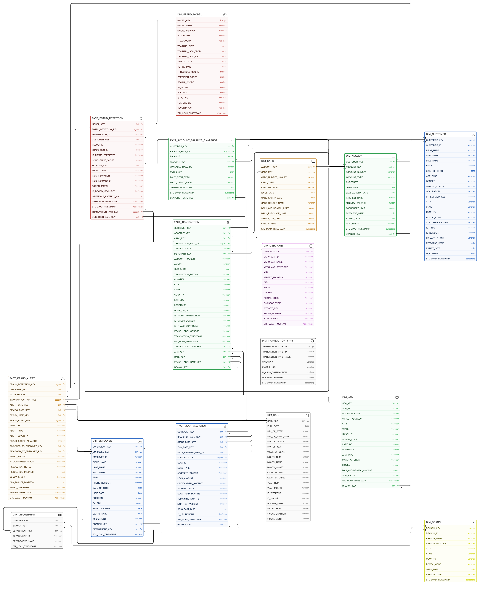
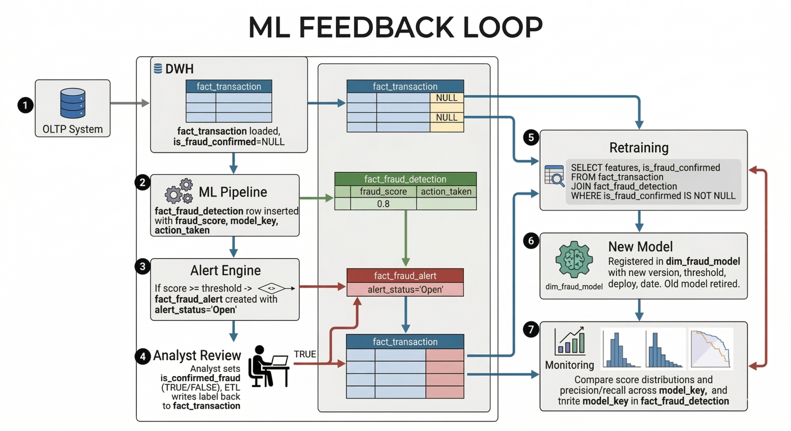

#  Real-Time Banking Fraud Detection Data Warehouse

> A production-grade, end-to-end real-time fraud detection pipeline built on modern data engineering principles. The system ingests banking transactions via Change Data Capture (CDC), enriches them with customer and account context, scores them with a machine learning model in real time, and lands everything into a Snowflake data warehouse modeled as a Kimball snowflake schema for analytics.

---

##  Table of Contents

- [Architecture Overview](#architecture-overview)
- [Project Structure](#project-structure)
- [Data Warehouse Schema](#data-warehouse-schema)
- [Components In Detail](#components-in-detail)
  - [Change Data Capture (CDC)](#1-change-data-capture-cdc)
  - [Streaming Pipeline (Flink)](#2-streaming-pipeline-flink)
  - [Machine Learning](#3-machine-learning)
  - [Airflow Orchestration](#4-airflow-orchestration)
  - [dbt Transformations](#5-dbt-data-warehouse-transformations)
  - [Infrastructure](#6-infrastructure)
- [ML Feedback Loop](#ml-feedback-loop)
- [Analytics Use Cases](#analytics-use-cases)
- [Getting Started](#getting-started)
- [Web UIs](#web-uis)
- [Security](#security)
- [Tech Stack](#tech-stack)
- [License](#license)

---

## Architecture Overview


**Data flow summary:**

1. **MSSQL → Debezium** — Captures every `INSERT`, `UPDATE`, and `DELETE` at the row level via SQL Server CDC
2. **Kafka** — Streams CDC events as JSON messages to consumers
3. **Flink** — Enriches transactions with Redis-cached dimensions, engineers 30+ features, and scores each transaction with an ML model in real time
4. **S3** — Stores enriched, scored data as partitioned Parquet files (`dt=YYYY-MM-DD/hr=HH`)
5. **Airflow** — Orchestrates `COPY INTO` from S3 into Snowflake staging tables
6. **dbt** — Transforms raw staging data into a Kimball star schema: staging → dimensions → facts

---

##  Project Structure

```
real-time-fraud-data-warehouse/
│
├── config/                              # Configuration & credentials
│   ├── .env.example                     # Template for secrets (copy to .env)
│   ├── flink.ini                        # Flink job configuration
│   └── kafka/
│       └── connect-debezium.json        # Debezium CDC connector config
│
├── docker/                              # Docker infrastructure
│   ├── airflow.Dockerfile               # Airflow image with ODBC + dbt
│   ├── flink.Dockerfile                 # Flink image with PyFlink + ML deps
│   ├── docker-compose-airflow.yml       # Airflow webserver + scheduler + Postgres
│   ├── docker-compose-cdc.yml           # Kafka + Zookeeper + Debezium Connect
│   └── docker-compose-flink.yml         # Flink JobManager + TaskManager + Redis
│
├── streaming/                           # Real-time pipeline (PyFlink)
│   ├── jobs/
│   │   ├── transaction_cdc_enrichment.py    # Main Flink job
│   │   └── redis_cache_loader.py            # Pre-loads MSSQL dimensions into Redis
│   ├── src/
│   │   ├── domain/
│   │   │   └── features.py              # Feature engineering (30+ fraud indicators)
│   │   └── infrastructure/
│   │       ├── redis_lookup.py          # Redis-first dimension lookup with MSSQL fallback
│   │       └── sinks.py                 # Dual-stream S3 Parquet writer
│   └── utils/
│       └── config_loader.py             # Centralized config with Docker secrets support
│
├── ml/                                  # Machine Learning
│   ├── train_fraud_model.py             # Model training (unsupervised + supervised modes)
│   └── models/
│       └── README.md                    # Model binary is gitignored
│
├── pipelines/                           # Airflow DAGs & ETL scripts
│   ├── requirements.txt
│   └── dags/
│       ├── fraud_dwh_dag.py                     # Recurring 6-hour batch ELT
│       ├── initial_load_dag.py                  # One-time full initial load
│       ├── realtime_s3_to_snowflake_dag.py      # Minutely real-time S3→Snowflake
│       └── scripts/
│           ├── db_config.py                     # Credential resolver
│           ├── extract_to_s3.py                 # MSSQL → S3 Parquet extractor
│           ├── s3_to_snowflake.py               # S3 → Snowflake COPY INTO
│           ├── snowflake_schemas.py             # Table DDL & stage mappings
│           └── sql_queries_extract.py           # MSSQL extraction queries
│
├── dbt_fraud_dwh/                       # dbt project (Snowflake transformations)
│   ├── dbt_project.yml
│   ├── profiles.yml                     # Snowflake connection (env vars)
│   ├── packages.yml                     # dbt dependencies (dbt_utils)
│   ├── macros/
│   │   └── generate_schema_name.sql     # Custom schema routing macro
│   └── models/
│       ├── staging/                     # 13 staging views (raw → typed)
│       ├── dimensions/                  # 10 dimension tables (SCD1 + SCD2)
│       ├── facts/                       # 5 fact tables
│       └── schema.yml                   # Column-level tests & documentation
│
├── scripts/                             # Deployment & setup scripts
│   ├── create_kafka_topics.sh           # Creates required Kafka topics
│   ├── setup_debezium.sh                # Deploys Debezium CDC connector
│   ├── submit_flink_job.sh              # Trains model + submits Flink job
│   └── snowflake_s3_setup.sql           # Snowflake stages, file formats, DDL
│
├── tests/                               # Test suites
│   ├── conftest.py
│   ├── streaming/                       # Streaming pipeline unit tests
│   ├── pipelines/                       # DAG / ETL integration tests
│   └── ml/                              # ML model tests
│
├── Makefile                             # One-command deployment targets
└── .gitignore
```

---

##  Data Warehouse Schema

The Snowflake data warehouse follows the **Kimball dimensional modeling** methodology, implemented as a snowflake schema. It supports three analytical domains: transaction analytics, fraud detection & ML model performance monitoring, and banking operations (loans, accounts, branches).

[`Detailed Schema`](assets/DWH_schema.docx)

### Snowflake Schema Overview





### Dimension Tables

| Table | SCD Type | Description |
|---|---|---|
| `dim_date` | Type 1 | Universal time dimension (YYYYMMDD surrogate key). Shared by all facts. |
| `dim_customer` | **Type 2** | Customer attributes. SCD2 captures address, segment, and occupation changes for point-in-time accuracy. |
| `dim_account` | **Type 2** | Account attributes. SCD2 tracks interest rate, overdraft limit, and type upgrades. |
| `dim_merchant` | Type 1 | Merchant reference data including MCC (Merchant Category Code), location, and geo-coordinates. |
| `dim_card` | Type 1 | Card attributes. Raw card numbers are **never stored** — only SHA-256 hashes (PCI DSS). |
| `dim_branch` | Type 1 | Branch location and type reference used across transactions, employees, and accounts. |
| `dim_employee` | **Type 2** | Analyst and reviewer history. SCD2 for audit and compliance on alert assignment changes. |
| `dim_department` | Type 1 | Organizational hierarchy linking branches and employees. |
| `dim_atm` | Type 1 | ATM location, hardware, and status for ATM-channel fraud pattern detection. |
| `dim_transaction_type` | Type 1 | Transaction classification lookup (Payment, Transfer, Withdrawal, etc.). |
| `dim_fraud_model` ⭐ | Type 1 | **DWH-introduced** (no OLTP equivalent). Tracks every ML model version deployed, enabling champion/challenger comparisons and threshold auditing. |

> **SCD2 Pattern:** `effective_date` (NOT NULL) / `expiry_date` (NULL = active row) / `is_current` (BOOLEAN). Point-in-time joins use `BETWEEN effective_date AND COALESCE(expiry_date, '9999-12-31')`.

### Fact Tables

| Table | Grain | Description |
|---|---|---|
| `fact_transaction` | One row per financial transaction | Central fact. Covers card payments, ATM withdrawals, transfers, and branch transactions. Includes `is_fraud_confirmed` — the ground truth label written back by analyst review. |
| `fact_fraud_detection` | One row per ML inference run | Stores `fraud_score`, `risk_indication`, `action_taken`, and `fraud_type` per transaction per model version. Multiple rows per transaction support A/B model testing. |
| `fact_fraud_alert` | One row per fraud alert raised | Human review cornerstone. `is_confirmed_fraud` (TRUE / FALSE / NULL=pending) is the primary ML retraining label. Includes `resolution_minutes` for SLA reporting. |
| `fact_loan_snapshot` | One row per loan per month-end | Periodic snapshot of outstanding balance, interest rate, and payment schedule for portfolio analytics. |
| `fact_account_balance_snapshot` | One row per account per day | End-of-day balance capture for trend analysis, anomaly detection, and regulatory reporting. `balance_usd` enables cross-currency aggregation. |

### Key Design Decisions

- **PCI DSS Compliance** — Card numbers are stored as SHA-256 hashes only. No raw PANs, CVVs, or PINs exist anywhere in the DWH.
- **USD Normalization** — All monetary fact columns include a `_usd` counterpart normalized at transaction time for cross-currency analysis.
- **`dim_fraud_model`** — Introduced by the DWH layer (not present in the OLTP source) to enable multi-model version tracking, drift detection, and champion/challenger evaluation.
- **ETL Audit Columns** — Every fact table carries `etl_load_timestamp` for incremental load support, data lineage, and debugging.
- **Business Keys Preserved** — All dimension tables retain the original `{entity}_id` business key alongside the DWH surrogate key for traceability.

---

##  Components In Detail

### 1. Change Data Capture (CDC)

| File | Purpose |
|---|---|
| [`docker-compose-cdc.yml`](docker/docker-compose-cdc.yml) | Kafka broker + Zookeeper + Debezium Connect |
| [`connect-debezium.json`](config/kafka/connect-debezium.json) | SQL Server CDC connector configuration |
| [`setup_debezium.sh`](scripts/setup_debezium.sh) | Auto-deploys the connector to Kafka Connect |
| [`create_kafka_topics.sh`](scripts/create_kafka_topics.sh) | Creates required Kafka topics |

Debezium captures every `INSERT`, `UPDATE`, and `DELETE` on the MSSQL `Transaction` table and publishes them as structured JSON events to the Kafka topic `bank_cdc.BankingSystem.dbo.Transaction`. This provides a real-time, ordered, and replayable event stream of all banking activity.

---

### 2. Streaming Pipeline (Flink)

| File | Purpose |
|---|---|
| [`transaction_cdc_enrichment.py`](streaming/jobs/transaction_cdc_enrichment.py) | **Main Flink job** — consumes Kafka, enriches, scores, writes to S3 |
| [`redis_cache_loader.py`](streaming/jobs/redis_cache_loader.py) | Pre-loads Customer & Account tables from MSSQL into Redis |
| [`features.py`](streaming/src/domain/features.py) | Feature engineering — 30+ fraud indicators |
| [`redis_lookup.py`](streaming/src/infrastructure/redis_lookup.py) | Redis-first dimension lookup with MSSQL fallback |
| [`sinks.py`](streaming/src/infrastructure/sinks.py) | Dual-stream S3 Parquet writer (transactions + fraud detections) |

**The Flink job performs 4 steps per transaction:**

1. **Enrich** — Joins with Account and Customer data via Redis (sub-millisecond lookups), with MSSQL as fallback for cache misses
2. **Aggregate** — Computes sliding-window velocity features (transaction count and total amounts in last 1h and 24h)
3. **Engineer** — Generates 30+ fraud indicators including night transactions, location mismatch, dormant account activity, high-risk MCC codes, velocity anomalies, and more
4. **Score** — Runs the loaded ML model and assigns `fraud_score`, `risk_indication`, and `action_taken`

Output is written as **Parquet files to S3**, partitioned by `dt=YYYY-MM-DD/hr=HH`, in two streams: one for all enriched transactions and one for fraud detections only.

---

### 3. Machine Learning

| File | Purpose |
|---|---|
| [`train_fraud_model.py`](ml/train_fraud_model.py) | Training script for fraud detection models |
| [`flink.ini` — `[ml]` section](config/flink.ini) | Model path, score threshold, and versioning config |

**Two training modes:**

- **Unsupervised (cold start)** — Trains an Isolation Forest on raw transaction features. No labels required — ideal for initial deployment before analyst feedback accumulates.
- **Supervised (feedback loop)** — Trains a Random Forest using analyst-confirmed fraud labels queried directly from Snowflake (`fact_transaction.is_fraud_confirmed`).

The model is serialized as a `.joblib` file and loaded by the Flink TaskManager at startup. Each inference produces:

| Output Field | Type | Description |
|---|---|---|
| `fraud_score` | `DECIMAL(6,4)` | Raw model probability (0.0 – 1.0) |
| `risk_indication` | `VARCHAR` | Low / Medium / High / Critical |
| `action_taken` | `VARCHAR` | Pass / Step-Up-Auth / Flag / Block |
| `fraud_type` | `VARCHAR` | Account-Takeover, Card-Not-Present, ATM-Skimming, etc. |
| `confidence_score` | `DECIMAL(6,4)` | Calibrated model confidence |
| `risk_indicators` | `VARCHAR` | Top features that drove the score |

---

### 4. Airflow Orchestration

| DAG | Schedule | Purpose |
|---|---|---|
| [`fraud_dwh_dag.py`](pipelines/dags/fraud_dwh_dag.py) | Every 6 hours | Batch ELT: MSSQL → S3 → Snowflake → dbt |
| [`initial_load_dag.py`](pipelines/dags/initial_load_dag.py) | Manual trigger | One-time full historical load with `--full-refresh` |
| [`realtime_s3_to_snowflake_dag.py`](pipelines/dags/realtime_s3_to_snowflake_dag.py) | Every minute | Copies Flink's S3 Parquet output into Snowflake staging + triggers dbt |

**Credential management** ([`db_config.py`](pipelines/dags/scripts/db_config.py)) follows a strict priority chain to support both local and production deployments:

```
Airflow Variables → Docker Secrets (/run/secrets/env_file) → Environment Variables → Defaults
```

---

### 5. dbt Data Warehouse Transformations

The dbt project (`dbt_fraud_dwh/`) transforms raw Snowflake staging tables into the dimensional model using three layers:

| Layer | Count | Description |
|---|---|---|
| **Staging** (`models/staging/`) | 13 views | Type-cast raw Snowflake tables; union batch and real-time sources into a single clean source of truth |
| **Dimensions** (`models/dimensions/`) | 10 tables | Customer, Account, Branch, Card, Merchant, ATM, Employee, Department, Transaction Type, Fraud Model — with SCD2 handling where applicable |
| **Facts** (`models/facts/`) | 5 tables | Transaction, Fraud Detection, Fraud Alert, Loan Snapshot, Account Balance Snapshot |

A custom `generate_schema_name.sql` macro controls schema routing, and `schema.yml` provides column-level tests (not-null, unique, accepted values, referential integrity) and documentation for every model.

---

### 6. Infrastructure

Three independent Docker Compose stacks communicate over a shared Docker network (`fraud-detection-network`):

| Stack | File | Services |
|---|---|---|
| **CDC** | [`docker-compose-cdc.yml`](docker/docker-compose-cdc.yml) | Kafka, Zookeeper, Kafka Connect (Debezium), Kafka UI |
| **Flink** | [`docker-compose-flink.yml`](docker/docker-compose-flink.yml) | Flink JobManager, TaskManager, Redis |
| **Airflow** | [`docker-compose-airflow.yml`](docker/docker-compose-airflow.yml) | Airflow Webserver, Scheduler, PostgreSQL metadata DB |

All stacks read credentials from `config/.env` via Docker secrets — no secrets are baked into any image or compose file.

---

##  ML Feedback Loop

The schema is purpose-built to close the supervised learning feedback loop. Human analyst decisions flow back into model retraining automatically:



##  Analytics Use Cases

The star schema directly enables the following analytics queries out of the box:

| Use Case | Tables Involved |
|---|---|
| Model Precision & Recall by Version | `fact_fraud_detection` + `fact_fraud_alert` + `dim_fraud_model` |
| False Positive Rate by Merchant Category | `fact_fraud_alert` + `dim_merchant` + `fact_transaction` |
| Customer Fraud Risk Score Trend | `fact_fraud_detection` + `dim_customer` + `dim_date` |
| Alert Resolution SLA Compliance | `fact_fraud_alert` + `dim_employee` + `dim_date` |
| Transaction Volume by Channel & Country | `fact_transaction` + `dim_date` + `dim_account` |
| Monthly Loan Portfolio Outstanding Balance | `fact_loan_snapshot` + `dim_customer` + `dim_date` |
| Account Balance Anomaly Detection | `fact_account_balance_snapshot` + `dim_account` + `dim_date` |
| Fraud Hotspot Geography (ATM / Merchant) | `fact_transaction` + `dim_atm` + `dim_merchant` |
| Model Score Distribution Drift Over Time | `fact_fraud_detection` + `dim_fraud_model` + `dim_date` |
| Ground Truth Label Rate by Analyst | `fact_fraud_alert` + `dim_employee` + `dim_date` |

---

##  Getting Started

### Prerequisites

- Docker Desktop (with Compose V2)
- Git Bash (Windows) or Bash (Linux/macOS)
- A running **MSSQL** instance with the `BankingSystem` database
- An **AWS** account with an S3 bucket
- A **Snowflake** account

### 1. Clone & Configure

```bash
git clone https://github.com/your-username/real-time-fraud-data-warehouse.git
cd real-time-fraud-data-warehouse

cp config/.env.example config/.env
# Edit config/.env and fill in all credentials
```

### 2. Start Infrastructure

```bash
# Start Kafka + Debezium CDC stack
docker compose -f docker/docker-compose-cdc.yml up -d

# Start Flink + Redis stack
docker compose -f docker/docker-compose-flink.yml up -d

# Start Airflow stack
docker compose -f docker/docker-compose-airflow.yml up -d
```

### 3. Set Up Snowflake

Run [`scripts/snowflake_s3_setup.sql`](scripts/snowflake_s3_setup.sql) in your Snowflake worksheet to create:
- S3 storage integration
- External stages pointing to your S3 bucket
- Parquet file formats
- Raw staging tables

### 4. Deploy the Debezium CDC Connector

```bash
./scripts/setup_debezium.sh
```

### 5. Submit the Flink Streaming Job

```bash
./scripts/submit_flink_job.sh
```

This script will automatically:
1. Download required Kafka connector JARs
2. Copy JARs into the Flink containers
3. Pre-load Redis with dimension data from MSSQL
4. Train the initial ML model (Isolation Forest — no labels required)
5. Submit the streaming job to the Flink cluster

### 6. Trigger the Initial Historical Load

Open the Airflow UI at `http://localhost:8085` and manually trigger the `fraud_dwh_initial_load` DAG. This performs a full historical load from MSSQL → S3 → Snowflake → dbt with `--full-refresh`.

### 7. Verify Real-Time Flow

Once the initial load is complete, the `realtime_s3_to_snowflake_dag` DAG runs every minute, continuously copying Flink's Parquet output from S3 into Snowflake and triggering incremental dbt runs.

---

##  Web UIs

| Service | URL | Credentials |
|---|---|---|
| Airflow | [http://localhost:8085](http://localhost:8085) | See `config/.env` |
| Flink Dashboard | [http://localhost:8081](http://localhost:8081) | None |
| Kafka UI | [http://localhost:8080](http://localhost:8080) | None |

---

##  Security

| Practice | Implementation |
|---|---|
| **No secrets in code** | All credentials loaded from `config/.env` (gitignored) via Docker secrets |
| **Credential fallback chain** | Airflow Variables → Docker Secrets → Environment Variables → Defaults |
| **PCI DSS compliance** | Card numbers stored as SHA-256 hashes only — no raw PANs, CVVs, or PINs anywhere in the DWH |
| **Column-level access control** | PII columns (name, email, DOB) are designed for Snowflake row/column-level security |
| **Safe template provided** | `.env.example` contains placeholder values only — safe to commit |
| **Gitignore** | `.env`, model binaries (`.joblib`), compiled dbt artifacts, and runtime data are excluded |

---

##  Tech Stack

| Layer | Technology |
|---|---|
| Source Database | Microsoft SQL Server |
| Change Data Capture | Debezium (Kafka Connect) |
| Message Broker | Apache Kafka |
| Stream Processing | Apache Flink (PyFlink) |
| Dimension Cache | Redis |
| Data Lake | AWS S3 (Parquet, partitioned) |
| Data Warehouse | Snowflake |
| Transformations | dbt (data build tool) + dbt_utils |
| Orchestration | Apache Airflow |
| ML Framework | scikit-learn (Isolation Forest + Random Forest) |
| Containerization | Docker & Docker Compose |
| Testing | pytest |

---


